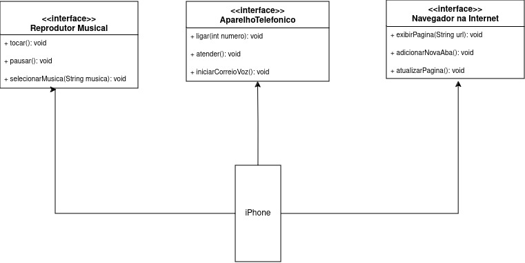

## Autores
- Tainan Rocha

## POO - Desafio
### Modelagem e Diagramação de um Componente iPhone

Neste desafio, modelei a representação UML do componente iPhone, abrangendo suas funcionalidades como Reprodutor Musical, Aparelho Telefônico e Navegador na Internet.

## Representação UML do iPhone

## Codigo seguindo o desing do UML

### Funcionalidades

- [Aparelho Telefonico](AparelhoTelefonico.java)
- [NavegadornaInternet](NavegadornaInternet.java)
- [ReprodutorMusical](ReprodutorMusical.java)

### Representação do iPhone
- [Iphone](Iphone.java)

### Usuario
- [Usuario](Usuario.java)
